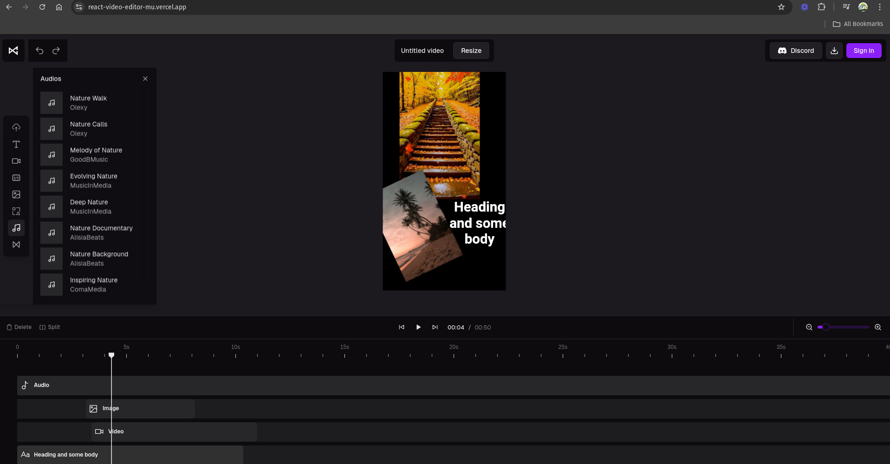

# Video editor in React JS

The project is for video editing through tools such as DesignCombo, ShaCDN, React, etc. In order to improve the quality of the user experience that comes with the use of these very heavy software, all this in a light and web-based way.

## Authors

- [@Pablituuu](https://www.github.com/Pablituuu)

## Installation

Install react-video-editor with npm

```bash
  git clone https://github.com/Pablituuu/react-video-editor.git
  cd react-video-editor
  npm install
  npm run dev
```

## Tech Stack

**Client:** React JS, TailwindCSS, ShaCDN, DesignCombo, Zustand

## License

[MIT](https://choosealicense.com/licenses/mit/)

## Demo

https://react-video-editor-mu.vercel.app/
{width=50%}
